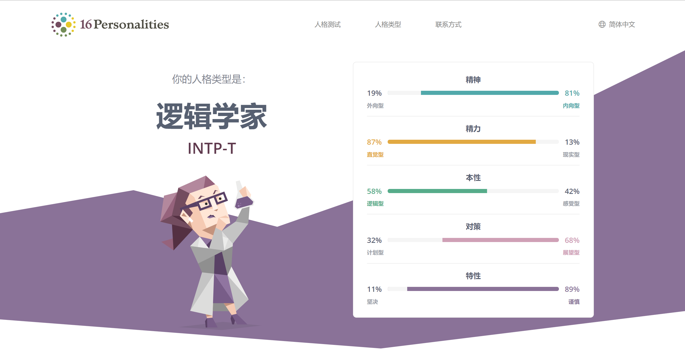
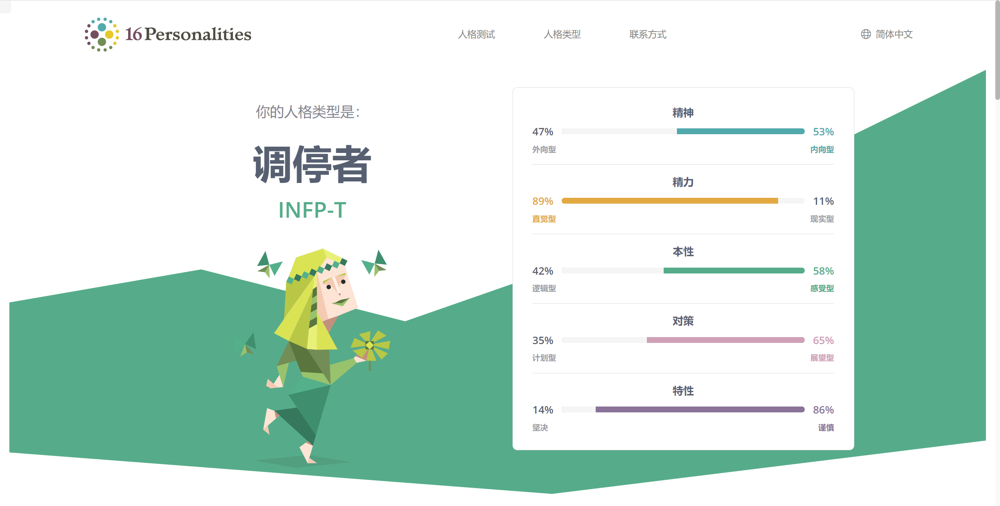
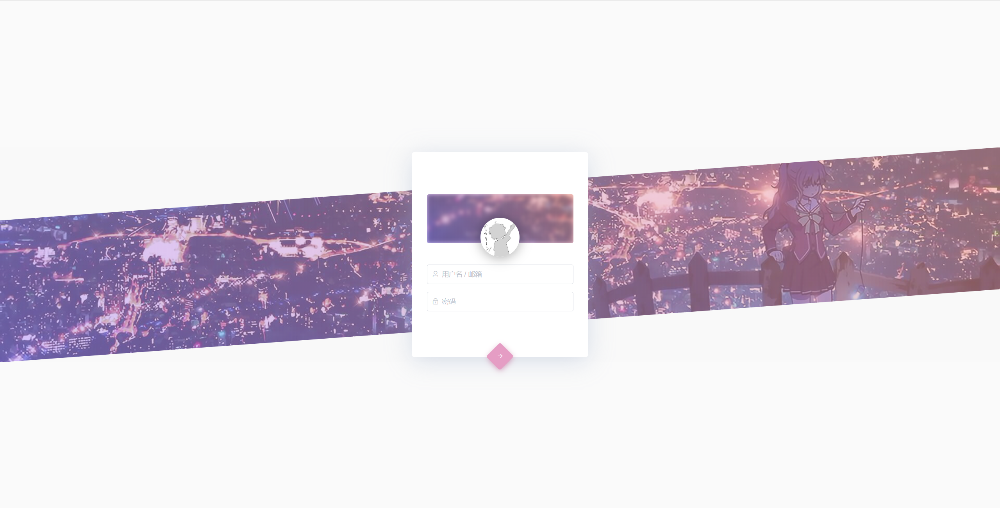

持之以恒
<!--more-->
## 我
爱好： 美食、追剧、心理学
人格类型： 

## 博客相关
创立于：2020年04月15日

    第一次尝试建立自己的博客。

话题：阅读、心理、音乐
程序：Hexo
主题：nexmoe https://nexmoe.com/hexo-theme-nexmote.html
## 网站

## 音乐
http://music.163.com/playlist/504382102/129387613/
## 梦想
- 未达成
    - <input disabled="" type="checkbox"> 申请一个自己的域名
    - <input disabled="" type="checkbox"> 26岁之前考驾照
    - <input disabled="" type="checkbox"> 一次说走就走的旅行  
*   已达成 
    *   <input checked="" disabled="" type="checkbox"> 一个自己的博客模板 
    *   <input checked="" disabled="" type="checkbox"> 自己的项目
    *   <input checked="" disabled="" type="checkbox"> 自己的电话号码
    *   <input checked="" disabled="" type="checkbox"> 一台用起来流畅的电脑 
    *   <input checked="" disabled="" type="checkbox"> 烂兄烂弟
    *   <input checked="" disabled="" type="checkbox"> 有一群准码农朋友
    *   <input checked="" disabled="" type="checkbox"> 几个超级负责的群管
+   注定的遗憾 
    +   <input disabled="" type="checkbox"> 考研之路  

 